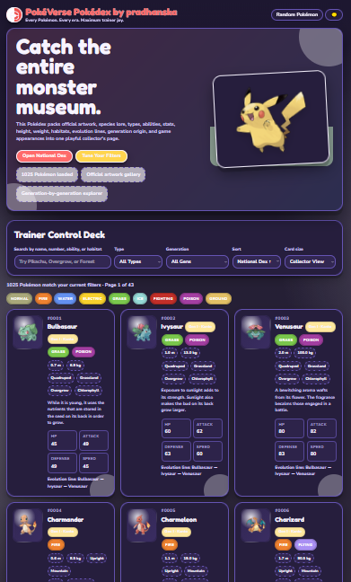
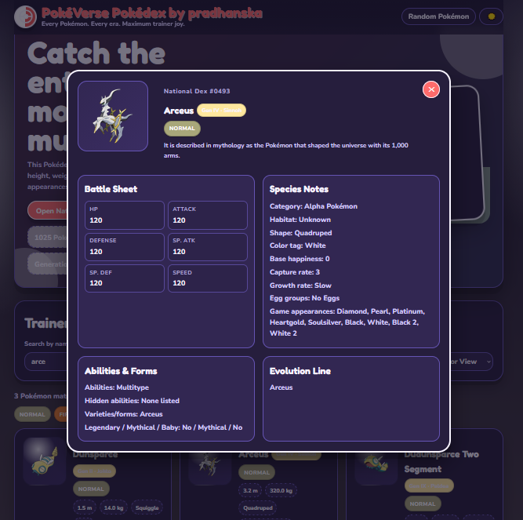

# PokéVerse Pokédex

A colorful, enthusiast-grade Pokédex web app built with pure HTML, CSS, and JavaScript.
Browse every Pokémon with official artwork, detailed stats, evolutions, abilities, habitats, generations, and advanced filtering — all inside a playful, responsive interface.

---

## ✨ Features

* 🎨 Cartoon-inspired responsive UI
* 🌙 Light / Dark theme toggle
* 🔎 Search by:

  * Pokémon name
  * National Dex number
  * Ability
  * Habitat
* 🧬 Filter by:

  * Type
  * Generation
* 📊 Sort by:

  * Dex number
  * Name
  * HP
  * Attack
  * Speed
* 🖼 Official Pokémon artwork
* 📖 Flavor text entries
* 🔄 Evolution line viewer
* 📈 Battle stats panel
* 🎮 Game appearance listings
* 🎲 Random Pokémon picker
* 📱 Mobile-friendly layout
* ♿ Accessibility enhancements
* ⚡ Built with no frameworks

---

## 📂 Project Structure

```text
pokemon-enthusiast-pokedex.html
```

Everything is contained in a single standalone HTML file:

* HTML markup
* CSS styling
* JavaScript functionality

No build step required.

---

## 🚀 Getting Started

### 1. Download the file

Save:


pokemon-enthusiast-pokedex.html
│
├── pokemon-enthusiast-pokedex.html
├── README.md
└── screenshots/
    ├── home.png
    └── detail.png

### 2. Open in your browser

Double-click the file or open it with:

* Chrome
* Firefox
* Edge
* Safari

That’s it.

---

## 🌐 API Used

This project uses the amazing PokéAPI:

* [https://pokeapi.co/](https://pokeapi.co/)

Artwork sources:

* Official artwork sprites
* Pokémon HOME sprites
* Default sprites as fallbacks

---

## 🧠 Data Included

For each Pokémon, the app loads:

* Name
* National Dex ID
* Types
* Abilities
* Hidden abilities
* Height & weight
* Stats
* Habitat
* Shape
* Color
* Generation
* Evolution chain
* Egg groups
* Capture rate
* Base happiness
* Growth rate
* Game appearances
* Legendary/Mythical/Baby status
* Pokédex flavor text

---

## 🎮 Controls

| Action            | Description                 |
| ----------------- | --------------------------- |
| Search Bar        | Search Pokémon and metadata |
| Type Filter       | Filter by Pokémon type      |
| Generation Filter | Filter by generation        |
| Sort Menu         | Sort results                |
| Card Size         | Toggle compact/full view    |
| Random Pokémon    | Open a random Pokémon       |
| Theme Toggle      | Switch light/dark mode      |

---

## 📱 Responsive Design

Optimized for:

* Desktop
* Tablets
* Mobile devices

Includes:

* Adaptive grid layouts
* Reduced-motion support
* Keyboard accessibility
* Focus-visible interactions

---

## ⚡ Performance Notes

The app dynamically loads Pokémon data from PokéAPI.

### Current behavior

* Loads all Pokémon data progressively
* Fetches species + evolution data
* Displays loading progress

### Potential Improvements

* Local caching
* IndexedDB support
* Lazy loading
* Virtualized rendering
* Service worker offline support

---

## 🛠 Technologies Used

* HTML5
* CSS3
* Vanilla JavaScript
* Fetch API
* PokéAPI

---

## 🎨 UI Highlights

* Gradient backgrounds
* Floating card animations
* Type-colored badges
* Collector-style cards
* Modal detail drawer
* Smooth scrolling
* Custom responsive typography

---

## ♿ Accessibility

Includes:

* ARIA labels
* Keyboard navigation
* Skip links
* Reduced motion support
* Semantic HTML
* Focus management

---

## 📸 Screenshots


<br><br>



---

## 🔮 Future Ideas

* Team builder
* Favorites system
* Compare Pokémon
* Region-only filters
* Shiny sprite toggle
* Battle simulator
* Offline mode
* Evolution tree visualization
* Audio effects
* Pokémon cry playback

---

## 👨‍💻 Author

Created by **pradhanska**

Made with maximum Poké-fan energy ⚡

---

## 📄 License

This project is open source and free to use for educational and personal projects.

Pokémon and related assets belong to Nintendo, Game Freak, and The Pokémon Company.

---

## 💛 Credits

* PokéAPI contributors
* Pokémon artwork creators
* Nintendo / Game Freak / The Pokémon Company

---
